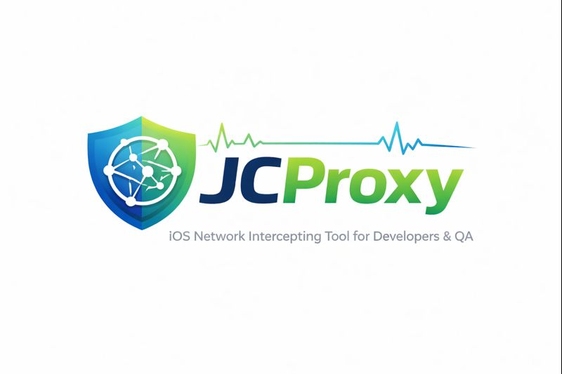
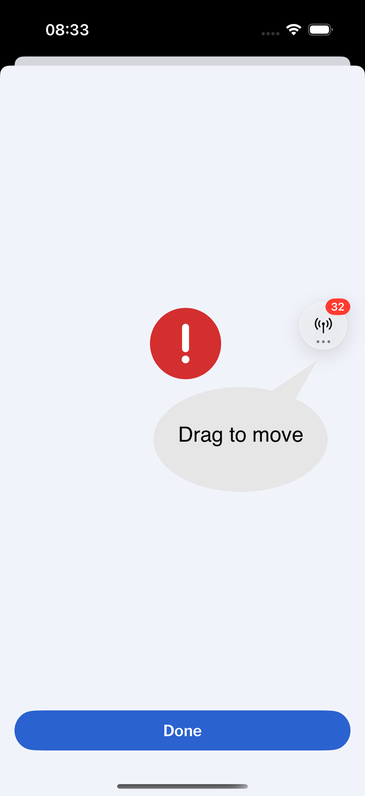
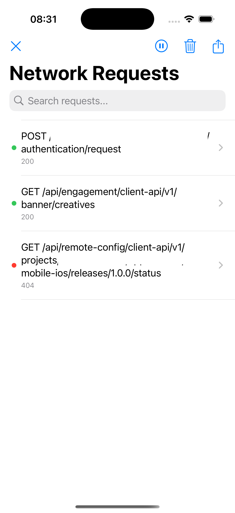
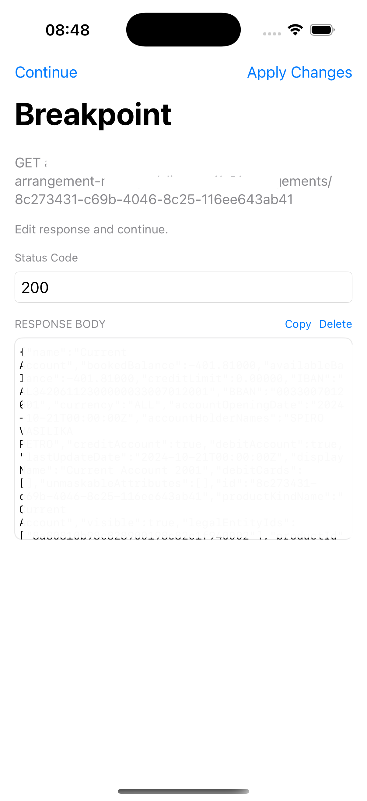

<p align="center">
  
</p>

# JCProxy

A lightweight **in‑app** HTTP proxy/logger for iOS that captures, inspects, and shares network traffic with a clean, developer‑first UI built for mobile teams.

## Why JCProxy
- Capture and inspect every request/response in real time.
- One‑tap sharing and export for collaboration or bug reports.
- Breakpoints to intercept and modify responses before they hit your app.
- Zero backend changes — works entirely on device.

## Highlights
- Live request list with searchable details.
- Rich request/response views (headers, body, cookies, cache data).
- HAR and raw export options.
- Breakpoints for response editing (status/body) and replay.
- Floating overlay launcher (draggable).
- JSON tree viewer with copyable values and base64/JWT decoding.
- Localized UI strings (EU languages included).

## Screenshots
- Overlay launcher with unread request badge and drag hint.

  

- Live request list with status indicators and quick navigation.

  

- Breakpoints manager for response intercepts 

  

- Breakpoint editor to change status code and response body before continuing.

  

## Install (Swift Package Manager)
In Xcode: **File → Add Package Dependencies**, then select the product:

```swift
packages:
  JCProxy:
    url: https://github.com/jasminceco/JCProxy
    from: 1.0.0
```

## Usage
Import and enable JCProxy where you bootstrap your app:

```swift
import JCProxy

JCProxyClient.shared.start()
```

## Breakpoints
Set a breakpoint for a specific API and JCProxy will pause the response, letting you:
- Continue as‑is
- Override status code
- Modify response body

This is ideal for testing error states and edge cases without changing the backend.

## Export & Share
From request details you can:
- Share a raw request/response
- Export HAR entries
- Copy large values or full bodies

## Localization Keys
JCProxy uses the main app bundle for localization. If you want to localize these strings, add them to your app's Localizable.strings (keys are in English).

```text
Request Details
REQUEST
URL
Method
Time
Duration
REQUEST HEADERS
REQUEST COOKIES
REQUEST BODY
RESPONSE
Status Code
RESPONSE HEADERS
RESPONSE COOKIES
RESPONSE CACHE
RESPONSE BODY
ERROR
Description
Domain
Code
Share Request
Share Raw Details
Share cURL
Share HAR File
Share Swift Model
Share Mock Server File
Cancel
OK
Copy
Copied!
Value copied to pasteboard.
Export Failed
Failed to export HAR file: %@
No JSON payload available to generate a model.
Failed to parse JSON payload.
Failed to create Swift model file.
Missing request URL.
Missing request method.
No response body available to generate a mock.
Response body is not valid JSON.
Unable to map request path to mock server pattern.
Failed to create mock file.
Network Requests
Search requests...
No network requests to export.
Log Parse Error
Share Failed
Unable to generate Swift model.
Unknown
Error
Loading...
Copy Key: Value
Decode Base64
Decoded Base64
Decoded JWT
Header
Body
Signature
JSON
Text
Bytes
Object
Array
String
Number
Bool
Null
Invalid UTF-8 string
key
keys
item
items
null
Network Trace
N/A
%.3f seconds
%.6f secs
Cache data missing
The cache information is missing from the entry
Before request
After request
expires
lastAccess
eTag
comment
HTTP type
Request Headers
Request Cookies
Request Body
Request time
Request status
HTTP Response code
Response Time
Response Headers
Response Cookies
Response Cache
Response Body
Roundtrip duration
Request Size
Completed
Failed
Pending
BREAKPOINT
Enable response breakpoint
Breakpoint
Edit response and continue.
Continue
Apply Changes
Breakpoints
No breakpoints yet.
Swipe to delete.
Delete
```

## Requirements
- iOS 15+
- Xcode 16+

## Coming Soon
- Request breakpoints (edit URL, headers, body).
- Export as cURL.

## Development Status
Under active development. Changes are delivered as time permits.

## License
MIT
